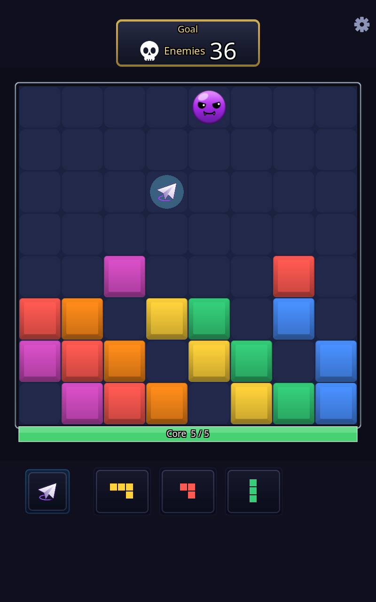
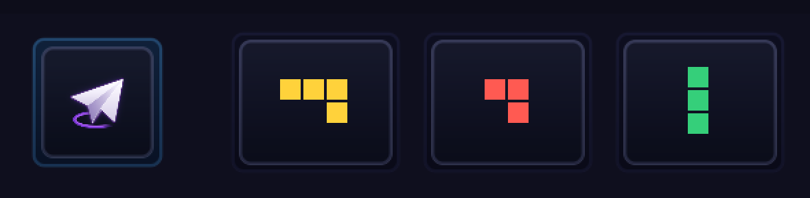
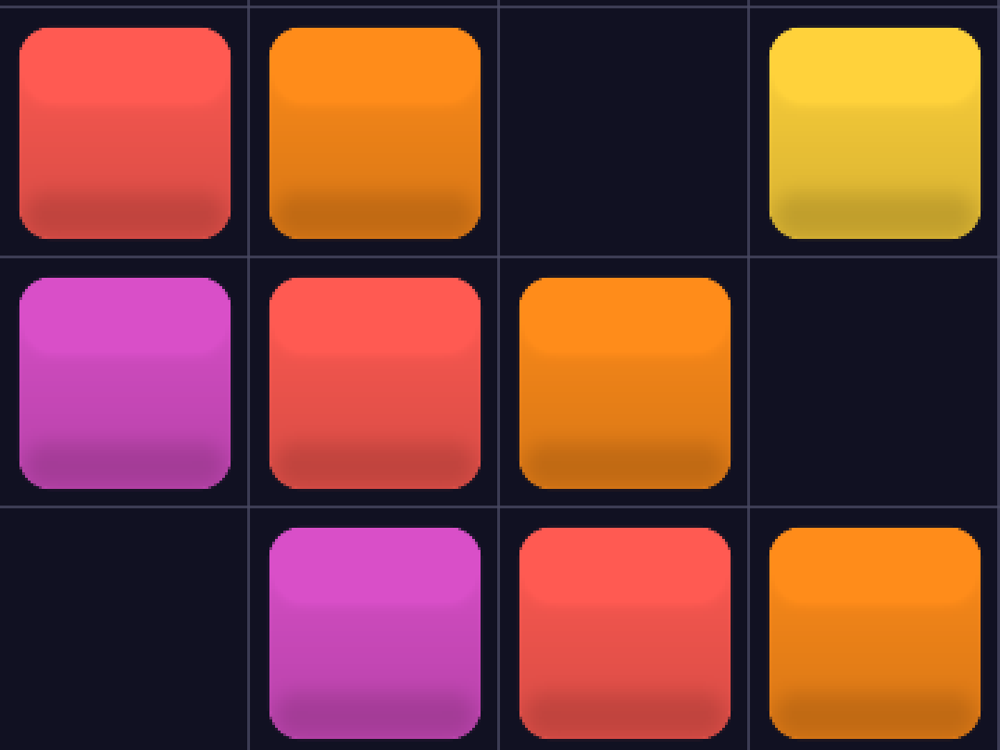
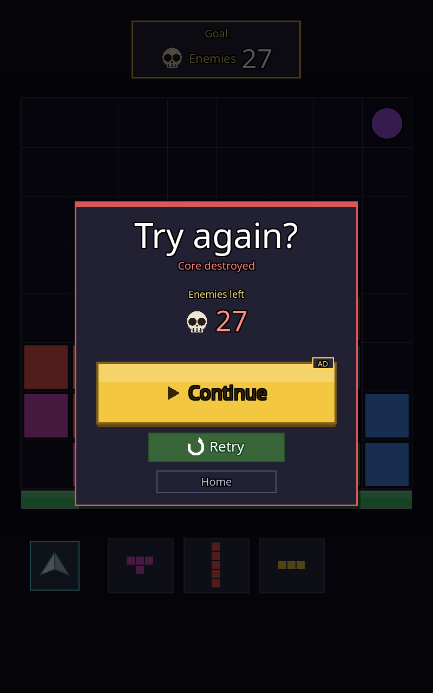
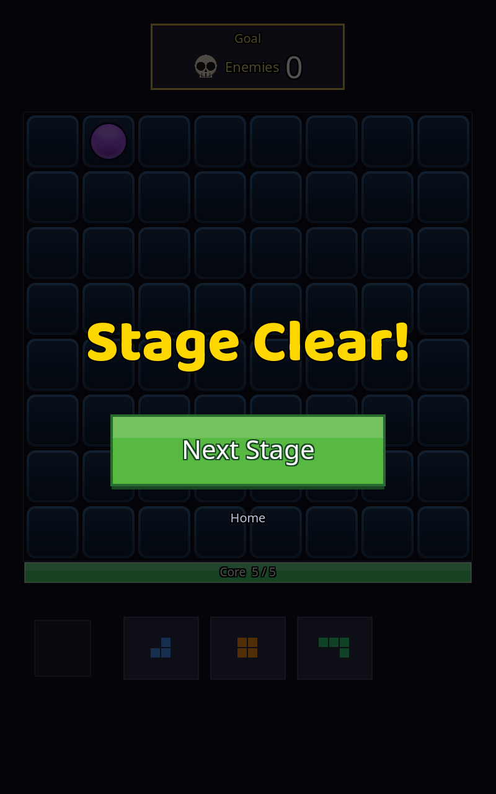
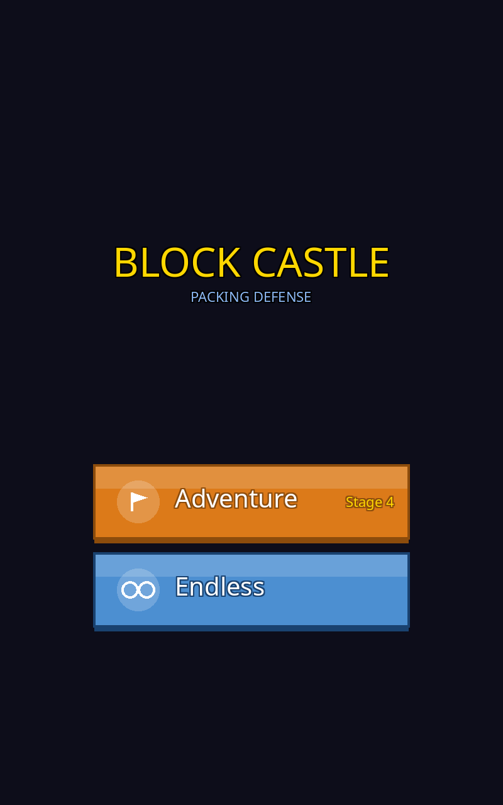
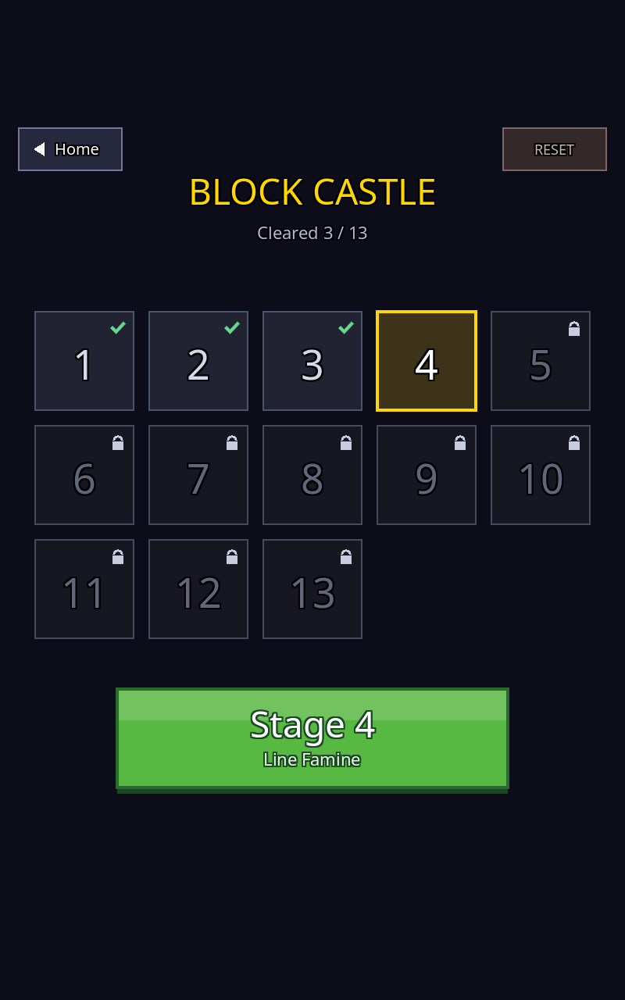
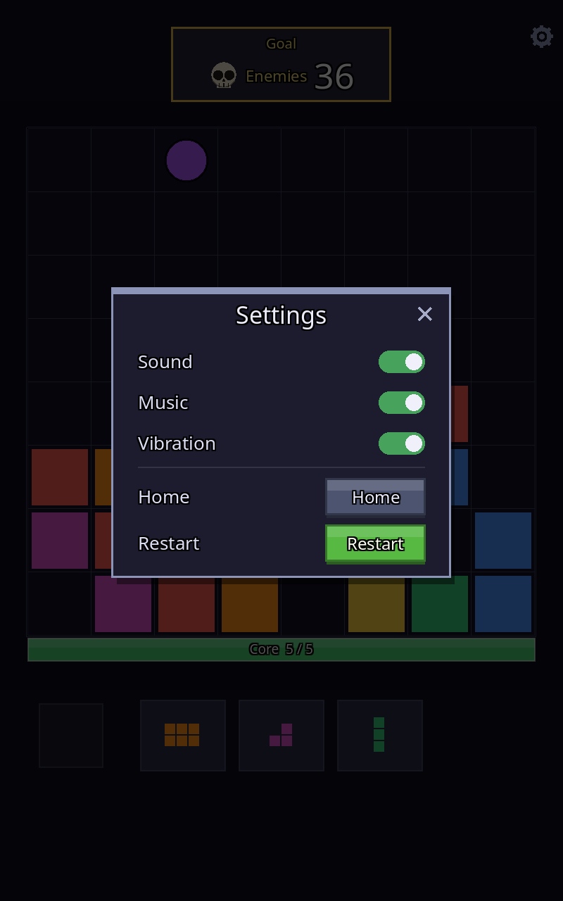

# BlockCastle — UI 아트 작업 의뢰서

> 대상: **UI/그래픽 디자이너**. 코드베이스를 몰라도 읽을 수 있게 썼다.
> 작성 2026-08-01 · 개정 2026-08-02(대회 마감 반영). 이 문서가 UI 아트 트랙의 정본이다.
> 현재 화면 캡처는 `design/current/` (이 문서에서 인라인으로 참조).

## ⏰ 마감

**대회 제출용 개발 완료 = 2026-08-08(토).** 오늘부터 6일이다.

| | 날짜 | 내용 |
|---|---|---|
| **P0 납품** | **8/4 (화)** | 블록 · 적(basic) · 패널 · 주버튼 — 이것만 바뀌어도 화면 인상이 갈린다 |
| **P1 납품** | **8/6 (목)** | 나머지 — 이 날이 **디자이너 최종 납품일** |
| 배선·검수 | 8/7 (금) | 개발이 전량 붙이고 확대 검수 |
| 동결·제출 | 8/8 (토) | 예비일 |

**P2는 이번 범위에서 제외한다**(§4 하단). 6일 안에 P0+P1을 넣는 것도 빠듯하다 — 우선순위를 지키는 게 전부 받는 것보다 중요하다.

---

## 🔴 0. 오늘(8/2) 답이 필요한 것 하나 — 블록을 어떤 물체로 볼 것인가

**이 질문 하나가 나머지 전부를 붙잡고 있다.** 뒤의 내용은 오늘 안 읽어도 되지만 이건 오늘 정해야 한다.

**왜 이것부터인가**

- 블록은 8×8 보드를 채우는 요소라 **화면에서 가장 오래·가장 많이 보인다**(§3-1). 지금은 라운드도 베벨도 광택도 없는 평면 사각형이라, 완성도가 가장 낮은 곳이 하필 가장 눈에 띈다.
- P0 6개 항목 중 **블록만 공수가 L**이고 나머지는 S~M이다. 일정에서 첫 이틀(8/2~8/3)이 통째로 블록에 걸려 있다(§6).
- 그래서 **여기서 하루 밀리면 뒤가 전부 하루씩 밀린다.** 8/4 P0을 못 지키면 P1(아이콘 8종·타일·카드 전량)을 통째로 버려야 한다. 6일뿐이라 만회할 여유가 없다.

**두 갈래 중 하나만 골라 주세요**

| | **(가) 기하학적 형태** | **(나) 질감 있는 물체** |
|---|---|---|
| 예 | 라운드 사각 + 베벨 + 은은한 광택 | 젤리 · 캔디 · 나무 · 유리 |
| 좋은 점 | 6색 전개가 싸고 나중에 스킨 늘리기 쉽다 | 표현 상한이 높다 — 인상이 확 달라진다 |
| 치르는 비용 | 인상이 바뀌는 폭은 (나)보다 작다 | 6색 전개와 이후 스킨 비용이 커진다 |
| 개발 쪽 사정 | 이미지가 늦어도 **코드로 흉내 낼 수 있다** — 최후 수단이 남는다 | 이미지가 없으면 아무것도 못 한다 |

**어느 쪽을 고르셔도 개발은 대응한다.** 다만 (나)는 그 최후 수단이 없어지므로 블록 1차 시안이 8/3(월)에는 나와야 한다.

> **배선은 이미 끝났다(8/2).** 게임 쪽은 `블록 이미지 1장`을 받아 6색으로 틴트하고 백열까지 태우는 경로를 전부 뚫어 놨고, 임시 블록으로 실제 동작을 확인했다(§8). **어느 쪽을 고르시든 파일만 주시면 그날 붙는다.**

**완벽한 답보다 빠른 답이 낫다.** 방향만 정해지면 시안은 주고받으며 고칠 수 있지만, 방향이 안 정해지면 아무것도 시작되지 않는다.

> **납품 형식은 둘 다 같다** — 어느 쪽이든 **180×180 PNG 1장**이다(§4 P0). 회색조로 주시면 6색은 코드가 입힌다. 자세한 규칙은 §5.

나머지 열린 질문(빈 공간·로고)은 대회 후로 미뤘다 → §7.

---

## 1. 게임 한눈에

세로 화면 모바일 게임. **블록 퍼즐 + 디펜스**를 붙였다.

- 8×8 보드에 블록 조각을 끌어다 놓는다 → 가로/세로 줄이 꽉 차면 터진다
- 줄이 터지면서 위에서 내려오는 **적**을 처치한다
- 적이 보드 아래 **거점(Core)** 까지 닿으면 HP가 깎이고, 0이 되면 패배
- 모드 2개: **Adventure**(14스테이지 진행) / **Endless**(무한 하이스코어)

플랫폼은 **안드로이드 우선, 세로 전용, UI 언어는 영어**. 톤은 "코지(cozy)" — 가볍게 도파민을 주는 캐주얼 퍼즐을 지향하고, 어둡고 무거운 방향이 아니다.

---

## 2. ⚠ 먼저 알아야 할 제약: 모든 UI가 코드로 그려진다

이 게임에는 **인게임 이미지 에셋이 단 하나도 없다.** 폰트 2개를 빼면 전부 프로그램이 좌표를 계산해 사각형·원·선을 그린 결과다. 지금 보이는 모든 버튼의 그림자·테두리·하이라이트가 손으로 쓴 숫자다.

**이게 작업 방식에 주는 영향:**

| | |
|---|---|
| ❌ 필요 없는 것 | 완성된 화면 시안(목업) 한 장 |
| ✅ 필요한 것 | **낱개 부품 이미지 + 수치 스펙** |
| ⚠ 절대 금지 | **이미지 안에 글자 넣기.** 모든 텍스트는 코드가 그리고, 나중에 다국어로 바뀐다 |

목업은 방향 합의용으로 주셔도 좋지만, 최종 납품물은 **잘라 쓸 수 있는 부품**이어야 한다. 부품을 받으면 개발(Claude)이 게임에 붙이고, 확대 스크린샷으로 검수 루프를 돌린다.

**화면 규격**: 논리 해상도 **가로 800px 고정**, 세로는 기기마다 가변(기준 800×1280). 가로가 고정이라 **보드 블록은 어떤 기기에서도 항상 정확히 90px**이다 — 스케일 걱정 없이 그려도 된다.

---

## 3. 현재 화면과 문제점

### 3-1. 인게임 — 최우선 작업 대상



- 상단: Goal 카드(남은 적 수) + 우측 설정 기어
- 중앙: 8×8 보드 (셀 90px, 보드 전체 720×720, 좌우 여백 40px)
- 보드 하단: 거점 HP 바 (`Core 5/5`)
- 하단: 조각 트레이 3슬롯 — 여기서 조각을 끌어다 보드에 놓는다
- 좌하단: **종이비행기 보유 슬롯**(90×90). 보드에 픽업으로 떨어지고, 집으면 이 슬롯에 들어가며 탭 두 번(조준→발사)으로 쓴다. **세상에 한 대뿐인 특별한 물건**이라는 인상이 필요하다

**종이비행기 — 보유 슬롯(좌) + 조각 트레이 3슬롯(우), 2배 확대:**



위 인게임 캡처의 보드 한가운데(짙은 청록 원 안)에 있는 것이 **보드 픽업** 상태고, 이 확대본 왼쪽이 **집은 뒤 슬롯**에 들어간 모습이다. 트레이 조각들과 나란히 앉아 “손에 든 것들” 한 줄로 읽히게 돼 있다 — 슬롯 테두리가 청록인 것도 조각 슬롯과 구분하려는 장치다. 지금은 흰 삼각형 두 장을 접어 붙인 형태뿐이라 “특별한 한 대”로는 약하다.

**블록을 3배 확대한 모습:**



**⚠ 이 캡처는 2026-08-02 기준이고, 블록은 그 사이 한 번 바뀌었다.** 원래는 완전한 평면 단색 사각형이었다(라운드·베벨·광택·테두리 전부 없음, 코드상 `사각형 그리기` 한 줄). 지금 보이는 라운드+베벨+광택은 **개발이 임시로 넣은 자리지킴이**다 — §6이 말한 "디자이너 없이 코드로도 되는 최후 수단"을 실제로 만들어 둔 것이고, 회색조 1장을 코드가 6색으로 틴트하는 방식이 진짜로 도는지 확인하는 게 목적이었다.

**그래서 §0 결정은 그대로 필요하다.** 이건 (가) 기하학 안의 최소치일 뿐이고, 디자이너가 (나) 질감을 고르면 통째로 버린다. (가)를 고르셔도 이것보다 잘 만드셔야 한다 — 지금은 수직 그라디언트 하나에 광택 한 겹이 전부다.

**빈 셀도 같이 자리지킴이가 들어갔다(8/2 밤).** 블록만 둥글고 빈 칸은 각진 평면이라 짝이 안 맞았다 — 빈 칸을 같은 반경의 '소켓'으로 만들어 한 벌로 보이게 했다. 이것도 최종이 아니다. §4 P0이 말한 대로 **빈 셀은 블록과 짝으로 봐야 판단이 되므로 두 장을 함께** 주세요.

블록은 여전히 **화면에서 가장 오래·가장 많이 보이는 요소**라 투자 대비 효과가 제일 크다. 자리지킴이가 들어갔다고 우선순위가 내려가지 않는다.

### 3-2. 결과 팝업 — 판이 끝날 때마다 뜬다

 

- 왼쪽: **실패** — 카드 패널 + 헤드라인 + 사유 + CTA 3개(광고 이어하기 / 재도전 / 홈)
- 오른쪽: **클리어** — 의도적으로 카드가 없다. 성적을 매기지 않고 헤드라인 + 다음 판 버튼만 (기획 확정 사항)

**변종이 많다.** 모드 3종(캠페인·무한·마지막 스테이지) × 상태(클리어·실패·광고 대기) + 목표 종류별 본문 2종(보석 수집 / 금고 보호). **시안이 1장이 아니라 7~8장 나오는 화면**이다.

### 3-3. 허브 — 앱을 켜면 처음 보는 화면



- 로고 텍스트 + 태그라인 (※ 로고도 지금은 그냥 폰트다 — 로고 아트는 별도 논의)
- 큰 버튼 2개: Adventure(주황) / Endless(파랑)
- 버튼 하나가 **그림자 → 본체 → 상단 하이라이트 → 테두리 → 아이콘 → 라벨** 6겹으로 쌓여 있다

**문제**: 위아래 여백이 과하게 비어 있다(로고와 버튼 사이). 아래 §7-2 참조.

### 3-4. 스테이지 진행 화면



- 14개 타일 그리드 — **누르는 화면이 아니라 "어디까지 왔나"를 보여주는 리드아웃**이다. 클리어=체크, 현재=금색 테두리, 미해금=자물쇠
- 하단 큰 버튼으로만 진행한다 (스테이지 골라 재플레이하는 기능은 기획상 폐기됨)
- ※ 우상단 `DEV WIPE`는 **플레이테스트용 버튼**이다(진행도 초기화). 사이드로드 테스트 빌드에서만 보이고 스토어 출고본에는 없다 — 무시할 것

### 3-5. 설정 모달



- 플레이 중 우상단 기어로만 열린다 (허브에는 기어가 없다)
- 토글 2개(Sound/Music) + 액션 2개(Home/Restart) + 지역에 따라 개인정보 옵션 1행
- 결과 팝업과 **패널 구조가 동일** — 부품을 공유할 수 있다

---

## 4. 요청 산출물

게임에 있는 UI 요소를 **빠짐없이** 적었다(코드의 그리기 함수 전수 조사 기준). 우선순위와 납품 마감을 함께 표시한다.

- **P0 = 없으면 리스킨한 티가 안 난다.** 여기까지가 최소 성공선 — **8/4(화) 납품**
- **P1 = 대회 제출 품질.** 여기까지가 목표선 — **8/6(목) 납품**
- **P2 = 이번 범위 제외.** 조건부로만 노출되거나 기능이 꺼져 있는 것들 — 대회 후

공수(S/M/L)는 **개발 쪽 추정**이니 디자이너가 덮어써 주세요.

### 🔴 P0 — 8/4(화) 납품

| 항목 | 화면 | 규격 | 공수 | 비고 |
|---|---|---|---|---|
| **블록 마스터** | 인게임 | **180×180 PNG** = 셀 1칸 전체(90px의 2배) | **L** | 흰색/회색조 1장으로 주시면 6색을 코드가 틴트 → **스킨 확장이 공짜**. 색마다 광택을 다르게 하려면 6장 개별도 가능. **블록 사이 간격도 이 180×180 안에서 정해 주세요** |
| **빈 셀 배경** | 인게임 | 180×180 | S | 블록이 없는 칸. 블록과 짝으로 봐야 판단이 되므로 함께 받는다 |
| **패널 (9-slice)** | 결과·설정 | 임의 크기 + **마진 4방향 px 명시** | M | 결과 팝업과 설정 모달이 **같은 부품을 공유**한다. **다크 톤을 그림이 갖는다**(여기만 코드가 색을 안 입힘) |
| **패널 상단 강조바** | 결과·설정 | **패널과 같은 캔버스·같은 마진**의 레이어 1장 | S | 클리어=금색 / 실패=붉은색으로 **색만** 바뀐다 → **흰/회색조**로 주세요. ⚠아래 "강조바는 띠가 아니라 레이어" 참조 |
| **큰 버튼 (9-slice)** | 결과·허브 | **회색조 마스터** × 상태 3종: 기본·눌림·비활성 | M | 색은 코드가 입힌다 — 초록·금색뿐 아니라 **주황·파랑도 같은 3장으로 나온다**(P1 항목 하나가 이걸로 사라졌다) |
| **적 — basic** | 인게임 | 180×180 | **S** | **스테이지1 적의 100%.** 블록과 함께 심사위원이 보는 첫 화면의 전부다. 현재는 바이올렛 원 하나. 공수가 작고 노출이 최대라 P0에 넣었다. HP가 닳으면 코드가 어둡게 틴트하니 **밝은 기준 상태 1장**만 |

#### 파일 이름 (놓기만 하면 붙습니다)

배선은 **8/2에 끝났습니다 — P0·P1 전부입니다.** 아래 이름 그대로 주시면 그날 화면이 갈아탑니다. **한꺼번에 안 주셔도 되고**, 안 온 것은 지금 렌더 그대로 남습니다.

`art/ui/` 아래(9-slice) — P0: `panel` · `panel_bar` · `btn_lg` · `btn_lg_press` · `btn_lg_off` · `btn_sm` · `btn_sm_press` · `btn_ghost`
P1: `card` · `card_edge` · `hp_track` · `hp_fill` · `slot` · `board_frame` · `tile` · `tile_front` · `tile_off` · `tut_bubble` · `tut_bubble_edge`

`art/` 아래(낱장) — 블록 `block.png` · **빈 셀 `cell.png`** · 종이비행기 `plane.png`
`art/enemies/` 아래 — `basic` · `swarm` · `fast` · `art/icons/` 아래 — 아이콘 8종

**한 장이 여러 곳을 덮는 것들** (따로 안 그리셔도 됩니다):
- `slot` = 트레이 3칸 **+ 비행기 보유 슬롯**. 둘 다 '물건이 앉는 자리'라 같은 물건으로 읽혀야 합니다.
- `card` = 목표 카드 **+ 보스 카드**. 동사(처치·수집·방어·보스)마다 테 색만 갈립니다.
- `plane.png` = 보드 픽업 **+ 보유 슬롯 + 발사 연출**. 크기 차가 크니(54px↔50px↔작게) 확대 회신을 보고 봐 주세요.
- `tile`만 주시면 세 상태가 전부 그것으로 그려집니다(`tile_front`·`tile_off`는 **선택**).

#### ⚠ 강조바는 '띠'가 아니라 '레이어'입니다

패널 위쪽의 금색/붉은색 강조바를 **8px짜리 띠 한 조각**으로 주시면 안 됩니다. 패널 모서리가 둥근데 띠는 각져서, **양 끝이 라운드 밖으로 삐져나옵니다**(자리지킴이로 실제로 그렇게 나왔습니다).

**대신 이렇게 주세요**: 패널과 **똑같은 캔버스에, 똑같은 마진으로**, 강조바만 그리고 나머지는 투명한 그림 1장. 포토샵/피그마에서 패널 레이어를 복제해 강조바만 남기고 지우면 됩니다. 이러면 모서리가 자동으로 맞고, 바의 두께·라운드를 디자이너가 쥡니다.

**이건 강조바만의 규칙이 아닙니다.** 게임이 색을 갈아끼우는 부분이 있는 부품은 전부 **본체 1장 + 그 부분만 남긴 레이어 1장**으로 받습니다. 세 쌍이 있습니다:

| 본체 | 색이 갈리는 레이어 | 무슨 색으로 갈리나 |
|---|---|---|
| `panel` | `panel_bar` | 클리어=금색 / 실패=붉은색 |
| `card` | `card_edge` | 목표 종류마다(처치=금색·수집=젬색·방어/보스=보라) |
| `tut_bubble` | `tut_bubble_edge` | 지시=노랑 / 손해 사건=붉은색 |

레이어 쪽은 **흰/회색조**로, **본체와 같은 캔버스·같은 마진**으로 주세요. 본체는 반대로 **다크 톤을 그림이 갖습니다**(코드가 색을 안 입힙니다).

#### ⚠ 버튼은 회색조로 — 색은 6개가 아니라 3장입니다

버튼은 **흰/회색조 마스터**로 주시면 코드가 색을 곱합니다(블록과 같은 방식). 그래서 **초록·금색·주황·파랑·회색이 같은 3장에서 나옵니다.** 색깔별로 그리지 마세요.

- 어두우면 색이 죽습니다 — 본체는 밝게(흰색 근처), 명암은 약하게.
- 상단 광택·테두리·아래 그림자를 **그림 안에 넣어 주세요.** 지금은 코드가 얹고 있는데, 진짜 그림이 오면 코드 쪽은 끕니다(이중으로 겹치면 탁해집니다).
- **고스트만 예외**입니다(P1). 보조 동작용이라 면을 채우면 안 되고 **테두리만** 있어야 합니다.

### 🟡 P1 — 8/6(목) 납품 · **디자이너 최종 납품일**

| 항목 | 화면 | 규격 | 공수 | 비고 |
|---|---|---|---|---|
| ~~버튼 색 변형 3종~~ → **고스트 1장만** | 허브·전역 | 9-slice, **속이 빈 테두리만** | S | 주황·파랑은 **안 그리셔도 된다**(P0 회색조 마스터를 코드가 틴트). 남은 건 보조 동작용 **고스트**뿐인데, 이건 면을 채우면 안 돼서 별도 1장이 필요하다 |
| 작은 버튼 (9-slice) | 설정 | **회색조 마스터** × 상태 2종 | S | 설정 모달의 Home/Restart, 좌상단 뒤로가기. 큰 버튼과 같은 규약(색은 코드) |
| **상시 아이콘 8종** | 전역 | 96×96 PNG 또는 SVG, **단색** | M | 기어 · 해골(적 수) · 체크(클리어) · 자물쇠(잠김) · 깃발(Adventure) · 무한 ∞(Endless) · 재생 ▶(광고) · 재시도 ↻ |
| **종이비행기** | 인게임 | 180×180(보드 픽업) + 슬롯용 동일 아트 | S | 보드 위 픽업 · 좌하단 보유 슬롯 · 발사체 3곳에 쓰인다. **"세상에 한 대"** 라는 특별함이 읽혀야 한다 |
| **목표 카드 배경** | 인게임 | 9-slice (기준 310×104) | S | 화면 상단 중앙 `Goal` 카드. 플레이 내내 떠 있다 |
| 거점 HP 바 | 인게임 | 9-slice (배경 + 채움 2종) | S | 보드 바로 아래 가로로 긴 띠 |
| 트레이 슬롯 배경 | 인게임 | 240×200 (120×100의 2배) | S | 조각이 놓이는 빈 슬롯 3개 |
| 보드 외곽 프레임 | 인게임 | 9-slice | S | 8×8 보드를 감싸는 테두리 |
| **스테이지 타일** | 스테이지 | 상태 3종: 클리어 · 현재 · 잠김 | M | 진행 화면의 14개 타일. 현재 위치는 금색 테두리로 구분 중 |
| 뒤로가기 버튼 | 스테이지 | 상태 2종 | S | 좌상단 Home |
| **튜토리얼 말풍선** | 인게임(S1) | 9-slice 알약형 (높이 36 기준) | S | 스테이지1 온보딩 지시문 판. **대회 심사위원은 전원 신규 플레이어라 이게 첫인상이다.** 지시(노랑)와 손해 사건(붉은색) 2색으로 쓰인다 — 배경 판은 **반드시 불투명**(뒤에 보드가 비치면 글자가 안 읽힌다) |
| **적 — swarm · fast** | 인게임 | 각 180×180 | S | **st2·st3에서 등장** = 심사위원이 거의 확실히 본다. swarm=라임 작은 원 3개(군집), fast=시안 화살촉(아래 향함, 속도감). 둘 다 정적 형태다 |

### ⚪ P2 — 이번 범위 제외 (대회 후)

| 항목 | 왜 뺐나 |
|---|---|
| 조건부 아이콘 3종 (보석 · 하트 · 부서진 하트) | 특정 목표 스테이지에서만 나온다 |
| 트로피 아이콘 | **리더보드 기능이 현재 꺼져 있어 화면에 아예 안 나온다** |
| 토글 스위치 (ON/OFF) | 설정 모달 전용 = 노출 최소 |
| 인게임 로고 | 공수 L에 별도 논의가 필요하다(§7-3). 6일 안엔 무리 |
| 보스 카드 | 보스 스테이지 미완성 — 기획이 먼저다 |
| **적 — tank · thief** | 정적 형태라 스프라이트로 바꿀 수 있지만 **st7 · st14 등장**이라 심사 플레이에선 거의 안 보인다. 대회 후 |
| **적 — bomb · split** | 몸통은 정적이나 **효과가 파라메트릭**이라 손이 더 간다(아래) + 등장도 늦다(st6 · st9) |

### 적 리소스에 대하여

처음엔 "적은 절차적이라 이미지로 대체 불가"라고 통째로 뺐는데 **틀렸다.** 렌더 코드를 뜯어보니 **7종 중 5종이 완전히 정적인 도형**이다.

| 적 | 첫 등장 | 지금 그려지는 방식 | 스프라이트 대체 |
|---|---|---|---|
| **basic** | st1 (100%) | 바이올렛 원 + 외곽선 | ✅ 완전 대체 → **P0** |
| **swarm** | st2 (60%) | 라임 작은 원 3개 | ✅ 완전 대체 → **P1** |
| **fast** | st3 (50%) | 시안 화살촉 삼각형 | ✅ 완전 대체 → **P1** |
| bomb | st6 (15%) | 숯색 구 + 도화선 + 맥동 후광 + 카운트다운 | ⚠ **몸통만** — 후광·도화선·숫자는 긴급도에 따라 매 프레임 변해 코드가 유지 |
| tank | st7 (55%) | 판금 + 베벨 + 이음선 2줄 + 리벳 4개 | ✅ 완전 대체 (등장이 늦어 P2) |
| split | st9 (40%) | 쌍둥이 blob — **분열선에 가까울수록 벌어지고 떨림** | ⚠ **분열 전/후 2장** — 벌어지는 정도는 코드가 계산 |
| thief | st14 | 후드 원 + 복면 띠 + 자루 | ✅ 완전 대체 (등장이 늦어 P2) |

**우선순위는 "등장 순서"로 갈랐다.** 대회 심사위원은 스테이지 1~4 정도를 볼 텐데, 거기 나오는 건 basic · swarm · fast 셋뿐이고 **셋 다 정적이라 공수가 작다.** 늦게 나오는 넷은 잘 만들어도 심사에서 안 보인다.

**공통 규칙** — 모든 적은 HP가 닳으면 코드가 어둡게 틴트하고, 전진할 때 밝은 링이 잠깐 덧그려진다. 그러니 **밝은 기준 상태 1장씩만** 주시면 된다. 손상·전진 상태는 만들지 않으셔도 됩니다.

### 범위 밖 (이번 회차에서 아예 다루지 않음)

**연출 효과**(줄 터짐 · 폭죽 · 거점 붕괴 · 콤보 텍스트 · 로켓 · 조준 링)는 제외한다. 매 프레임 값이 바뀌며 절차적으로 생성·애니메이션되는 요소라 정적 이미지로 대체되지 않는다. 별도 회차가 맞다.

---

## 5. 납품 형식 규칙

| 항목 | 규칙 |
|---|---|
| 파일 | **PNG(알파 포함)** 또는 **SVG**. Figma 링크는 열 수 없으니 **export 파일**로 |
| 배율 | **2배** (블록 180×180, 아이콘 96×96 등) |
| 텍스트 | **이미지에 절대 넣지 말 것.** 코드가 그린다 |
| 9-slice | 늘어나도 되는 영역의 **상/하/좌/우 마진을 px로 명시** (주석 이미지나 텍스트 어느 쪽이든). **파일 안 픽셀 기준**으로 적어 주세요 — 2배로 그리셨으면 2배 파일의 픽셀입니다. 화면 크기로 환산하는 건 코드가 합니다 |
| 색 | 이미지와 별개로 **hex 값 목록**을 같이 주세요 — 텍스트 색·틴트에 코드가 직접 씁니다 |
| 수치 | 라운드 반경 · 그림자 오프셋/블러 · 간격 · 폰트 크기를 **px 숫자로** |
| 폰트 | 현재 Noto Sans + Baloo2. 바꾸려면 **라틴 전용 + 오픈 라이선스**로 (한글은 아직 미지원) |

### 현재 색 팔레트 (참고용 — 바꿔도 됩니다)

**블록 6색** — 색상환 6방향으로 서로 최대한 멀게 잡은 값입니다. 색은 순수 장식이고 게임 규칙과 무관합니다.

`#ff5a52` 빨강 · `#ff8c1a` 주황 · `#ffd23b` 노랑 · `#35cf7a` 초록 · `#4a90ff` 파랑 · `#d94fc8` 보라

**배경** — 화면 `#0d0d1a` · 빈 셀 `#111122` · 격자선 반투명 회보라 · 강조 금색 `#ffd700`

---

## 6. 일정 — 6일 스프린트 (8/2 → 8/8)

대회 제출용 **개발 완료가 8/8(토)** 다. 역산하면 디자이너 납품은 그보다 이틀 앞서 끝나야 배선·검수 시간이 남는다.

| 날짜 | 디자이너 | 개발 (Claude) |
|---|---|---|
| **8/2 (일)** | **§0 블록 방향 결정**(기하학이냐 질감이냐) + 형식 합의 → 블록 착수 | 붙일 자리 준비(임포트 설정·틴트 파이프라인·가산 블렌드 패스) |
| **8/3 (월)** | 블록 1차 시안 | 받는 즉시 배선 → **확대 스크린샷 회신** |
| **8/4 (화)** | 🔴 **P0 납품** — 블록 확정 + 적(basic) + 패널 + 큰 버튼 | 블록·적·패널·버튼 배선 |
| **8/5 (수)** | P1 착수 — 아이콘 8종 + 비행기 + 적(swarm·fast) | 결과 팝업·설정 화면 배선 + 검수 회신 |
| **8/6 (목)** | 🟡 **P1 납품 = 최종 납품일** — 잔여 전량 | 아이콘·카드·타일·HP바 배선 |
| **8/7 (금)** | 검수 대응(수정 요청 반영) | **전량 배선 완료** + 전 화면 확대 검수 |
| **8/8 (토)** | — | 예비일 · 동결 · 제출 빌드 |

### 진행 방식

**하루 단위로 주고받는다.** 완성본을 한 번에 받는 게 아니라, 부품이 나오는 대로 넘겨주시면 그날 붙여서 **실제 게임 화면 확대 캡처로 회신**한다. 6일밖에 없어서 "다 그린 다음 붙이기"는 위험하다 — 붙여봐야 드러나는 문제(작은 크기에서 뭉개짐, 배경과의 대비, 색 밴딩)가 반드시 나온다.

### ⚠ 일정 리스크와 대비책

6일은 외주 UI 리스킨으로는 **매우 빠듯하다.** 솔직하게 적어 둔다.

- **P0가 8/4을 넘기면 P1을 버린다.** 블록 하나만 제대로 바뀌어도 대회 심사에서 보이는 인상은 크게 달라진다. 전부 어중간하게 바꾸는 것보다 낫다.
- **블록조차 어려우면 개발 쪽 대안이 있다.** 라운드 + 베벨 + 은은한 광택 정도의 기하학적 개선은 **디자이너 없이 코드로도 만들 수 있다.** 지금의 완전 평면보다는 확실히 낫다. 다만 표현 상한이 낮으니 어디까지나 최후 수단이다.
- **블록 방향(§0) 답이 늦어지면 전부 밀린다.** 오늘 안에 정해야 한다. 이 결정만 일정에서 뒤를 전부 붙잡고 있다.
  - **2026-08-02 밤 갱신 — 답이 오늘 안 왔다.** 개발 쪽 대응: ①배선은 P0·P1 **전 항목**이 끝났다(C124). 이제 어느 부품이든 파일이 오는 날 붙는다. ②블록은 코드제 임시본이 이미 들어가 있다(C118) — 그래서 **8/4 P0 하한선은 답이 늦어도 무너지지 않는다.** ③다만 그건 상한이 낮은 최후 수단이고, (나) 질감을 고르실 경우엔 대체가 안 된다. 결정이 8/3(월)을 넘기면 그때는 **블록을 코드제로 확정하고 디자이너 시간은 P1(카드·타일·아이콘·비행기)로 돌리는 편이 낫다** — 그쪽은 코드 대안이 없다.

> **참고 — 이 일정과 별개로 진행되는 것**: 이 게임은 대회와 별도로 Google Play 출시도 준비 중이고, 거기엔 "테스터 12명 × 14일 클로즈드 테스트"가 걸려 있다(구글 정책). 그 트랙은 8/8과 무관하게 굴러가므로 **디자이너가 신경 쓸 필요는 없다.** 대회 제출본이 우선이다.

---

## 7. 디자인 판단이 필요한 열린 질문

### 7-1. 블록 방향 → **맨 위 §0으로 옮겼다**

급한 질문이라 문서 앞으로 뺐다. 나머지 둘은 대회 후 사안이다.

### 7-2. 긴 화면의 빈 공간 *(대회 마감 후로 미룸)*

가로가 800px로 고정이고 보드는 위, 트레이는 아래(엄지가 닿는 위치)에 각각 붙어 있어서, **화면이 길어질수록 그 사이가 빈다.** 요즘 폰(9:19.5~9:20)에서 특히 두드러진다. 허브의 위아래 여백도 같은 원인이다.

보드를 키울지 여백을 재분배할지가 미결인데, **레이아웃을 건드리면 모든 좌표가 연쇄로 움직여서 6일 안에는 위험하다.** 대회 후에 다룬다. 의견은 언제든 환영.

### 7-3. 로고 *(P2 — 대회 후)*

현재 로고는 폰트로 찍은 글자다(`BLOCK CASTLE`). 스토어 아이콘은 이미 별도로 제작돼 있으니(`icons/`) 인게임 로고를 새로 갈지, 아이콘과 통일할지 판단이 필요하다. 공수가 커서 이번 6일에는 넣지 않는다.

---

## 8. 개발 메모 (디자이너는 안 읽어도 됨)

붙일 때 밟게 될 함정들. 미리 적어 둔다.

- **ETC2 압축 — 실측 결과 함정이 아니었다(2026-08-02 정정)**: 원래 "블록 이미지를 넣는 순간 손실 압축이 걸린다"고 적어 뒀는데, 플레이스홀더 PNG를 실제로 넣고 Android 프리셋으로 pck를 뽑아 텍스처 헤더를 뜯어보니 **180×180이 `dataformat=0` / `RGBA8` = 무손실**이었다. `import_etc2_astc=true`는 `compress/mode`를 **VRAM Compressed로 바꾼** 텍스처에만 적용되고, 2D 스프라이트의 기본 임포트는 Lossless(mode=0)다. 즉 **기본값 그대로 두면 밴딩은 안 생긴다.** 앞으로 할 일은 "무손실로 바꾸기"가 아니라 **누가 실수로 VRAM으로 바꾸지 않는지 지키는 것**이다.
- **트레이 프리뷰 17px**: 보드 셀은 90px 고정이라 문제없지만 트레이 미리보기는 셀 17px이다(5.3배 축소). 여기는 스프라이트를 쓰지 말고 **현재의 단순 사각형 렌더를 유지**하는 편이 낫다(LOD). 스냅백 연출이 90→17을 연속 보간하는 것도 같은 이유로 주의.
- ~~**백열 연출**~~ **(완료, C117)**: 줄이 터지기 직전 블록이 흰색으로 달아오르는데 `modulate`는 곱셈이라 텍스처보다 밝게 못 만든다. Godot의 `_draw()`는 그리는 도중 블렌드 모드를 못 바꿔서(머티리얼이 CanvasItem 단위) **`BLEND_MODE_ADD` 자식 노드**에 백열만 몰아 그리는 방식으로 해결했다. 대조군 프레임으로 실측 확인 — 가산을 끄면 금색에서 멈추고 켜면 흰색까지 간다.
- ~~**블록 배선**~~ **(완료, C116)**: 블록 쿼드를 그리던 **11곳**을 `_blit_block()` 하나로 모았다(보드 셀·충전 셀·폭발 프리뷰·착지 고스트·튜토리얼 타깃·손에 든 조각+그림자·트레이 프리뷰·붕괴 낙하·착지 팝·소멸 팝). 납품일엔 `art/block.png`를 놓기만 하면 된다. 파일이 없으면 예전 사각형 렌더로 떨어지므로 **아트가 늦어도 게임은 안 멈춘다.**
- **연출 재배선 목록**: 착지 팝·소멸 팝은 위 이음새를 타서 **자동으로 따라온다**. 남은 것 = 거점 붕괴 낙하(이음새는 탔지만 낙하 중 회전·스케일 없음) · 막힘사 페이드.
- **아이콘 배선 완료(C119)**: 8종 전부 `_blit_icon()` 이음새를 탄다. `art/icons/<이름>.png`를 놓으면 그 아이콘만 갈아탄다 — **8개를 한꺼번에 안 주셔도 된다.** 파일명은 `gear` · `skull` · `check` · `lock` · `flag` · `infinity` · `play` · `retry`. 임시 표식으로 실제 교체·틴트·자리 차지까지 확인했다. ⚠**해골만 틴트를 안 건다** — 현재 렌더가 뼈색+어두운 눈의 2색이라 색을 이미지가 갖는 게 맞다. 나머지 7종은 코드가 색을 입히므로 **흰 단색**으로 주세요(§4 P1 규격 그대로).
- **패널·버튼 9-slice 배선 완료(C122)**: 이음새 `_blit_9s` 하나 + 그 위의 `_draw_panel_box`·`_draw_btn_box`. 화면의 버튼은 전부 **그림자 → 본체 → 상단 하이라이트 → 테두리** 네 겹을 같은 순서로 쌓고 있었고 값만 달랐다 — 그 값을 인자로 올려 7곳(설정 미니버튼 2·결과 이어하기/재도전/홈·허브 2갈래·선택 플레이·뒤로가기)을 한 함수로 모았다. `art/ui/<이름>.png`가 없으면 기존 draw_rect 렌더로 떨어진다 — **12프레임 바이트 동일 + 회귀 골든 불변**으로 확인.
  - ⚠**`draw_style_box(StyleBoxTexture)`를 쓰면 안 된다.** 모서리를 **텍스처 픽셀 크기 그대로** 그려서 2배 납품본(§5)의 라운드가 화면에서 두 배로 부푼다. 스케일 인자가 없다 → `draw_texture_rect_region` 9번으로 직접 분할하고 마진을 `UI_TEX_SCALE`로 나눈다. 마진 표(`UI_9S`)는 **텍스처 픽셀** 기준이다.
  - ⚠**새 PNG는 `godot --headless --path . --import`를 한 번 돌려야 보인다.** `--script` 실행은 파일시스템 재스캔을 안 해서 `.import`가 없는 파일은 `ResourceLoader.exists()`가 false → **조용히 폴백으로 떨어진다.** 자리지킴이를 넣고도 "이음새가 안 도는 줄" 알고 한참 봤다. 임포트 후 `compress/mode=0`(무손실) 확인까지가 한 세트.
  - ⚠**강조바를 8px 띠로 만들면 안 된다** — 각진 양끝이 패널 라운드 밖으로 삐져나온다. 패널과 같은 캔버스·같은 마진의 레이어로 받아 **패널과 같은 사각형에** 얹는다(모서리가 정의상 일치).
  - **고스트 슬롯을 미리 팠다**(`btn_ghost`): 결과 팝업 홈 버튼만 각진 사각형으로 남아 라운드 이웃 사이에서 튀었다. 면을 채우는 마스터로 대신할 수 없어(위계가 무너진다) 별도 이름이 필요했다.
  - 자리지킴이 생성기 = `tools/make_ui_placeholder.py`(PNG는 **커밋 안 함** — 블록과 달리 지금 렌더가 이미 4겹 입체라 '최후 수단'이 급하지 않다. 필요하면 한 줄로 만든다).
- ~~**P1 절반이 같은 배관을 탄다**~~ **(완료, C124)**: 목표 카드·스테이지 타일·HP바·트레이 슬롯·보드 프레임·튜토 말풍선 + 종이비행기 + **빈 셀**까지 전부 붙였다. 이제 **P0·P1 전 항목이 배선돼 있다** — 남은 건 그림뿐이다.
  - **빈 셀은 P0인데 이음새가 없었다.** P0 표에는 있는데 파일명 목록에 없어서 못 보고 지나갔다 — 배선 목록을 표가 아니라 **파일명 목록** 기준으로 훑었어야 했다. `_blit_cell()`로 팠고 이름은 `art/cell.png`.
  - **테두리가 색 채널인 부품은 본체와 나눠 받는다** — 강조바에서 배운 것이 목표 카드(`card_edge`)와 튜토 말풍선(`tut_bubble_edge`)에서 그대로 반복됐다. 각진 스트로크를 라운드 위에 코드가 얹으면 귀퉁이가 튄다. §4에 규칙으로 승격했다.
  - **테를 못 나누는 곳은 '키워서 뒤에 깔기'로 처리했다**(타일 금색 테·슬롯 조준 테·HP바 피격 테). 블록 rim과 같은 해법이다([[sprite-swap-keeps-signal-channel]]) — 면을 안 덮으므로 색 신호가 안 죽는다.
  - **한 부품이 여러 자리를 덮게 묶었다**: `slot`=트레이 3칸+비행기 슬롯, `card`=목표+보스 카드, `plane.png`=픽업+슬롯+발사체. 납품 장수를 줄이는 것보다 **같은 물건으로 읽히게** 하는 쪽이 이유다.
  - `tile`만 와도 3상태가 다 그것으로 떨어진다(`tile_front`·`tile_off`는 선택). 상태별로 안 오면 화면이 섞여 보이는 걸 막는다.
  - 자리지킴이 생성기 = `tools/make_p1_placeholder.py`. **`art/cell.png`만 커밋한다**(C125) — 블록 자리지킴이가 이미 커밋돼 있어 빈 칸만 각진 평면으로 남으면 오히려 짝이 깨진다. 나머지(비행기·9-slice 11장)는 지금 렌더가 이미 입체라 급하지 않으므로 커밋 안 함.
  - 검증 프레임 3장을 하네스에 추가했다 — `e2_tut_msg`·`e3_tut_flash`(말풍선 2색)·`n_plane`(픽업+슬롯 동시).
  - ⚠**알약의 캡 반경은 9-slice 마진 안에 들어와야 한다.** 넘으면 모서리 조각이 잘린 채 늘어난다. 말풍선처럼 세로가 얇은 부품에서 실제로 걸린다(마진 표의 `tut_bubble` 세로가 24인 이유).
- **트레이 프리뷰 LOD**: 이음새에 하한 24px을 뒀다. 트레이는 셀 17px이라 자동으로 사각형으로 떨어진다. ⚠**스냅백이 90→17을 연속 보간**하므로 도중에 텍스처↔사각형이 갈아타는 순간이 생긴다 — 진짜 아트로 눈으로 보고 하한값을 조정할 것.
- **적 스프라이트 배선 완료(C123)**: `basic`(P0)·`swarm`·`fast`(P1) 3종이 `_blit_enemy()` 이음새를 탄다. `art/enemies/<이름>.png`를 놓으면 그 적만 갈아탄다. 화면엔 **한 칸(90px)** 으로 그리므로 여백은 180×180 안에서 그림이 정한다(블록과 같은 규약).
  - **HP 명암은 코드가 유지**: 도형 시절엔 색을 직접 `lerp`했지만 스프라이트엔 곱셈밖에 못 건다 → `_hp_tint()`가 기준색 대비 비율을 넘겨 **같은 명암 곡선**을 그림 위에 싣는다. 그래서 **밝은 기준 1장씩만** 받으면 된다. 전진 직후 밝은 링(`step_beat`)·조준 링도 코드 몫.
  - ⚠**피격 흰 플래시를 스프라이트 위에 원으로 덧칠하면 안 된다** — 실루엣이 안 맞고 색까지 덮는다(C121에서 이미 한 번 틀린 종류). 스프라이트 경로에선 **같은 그림을 가산으로 겹쳐** 밝히기만 한다. 그래서 가산 레이어(`BlockGlowLayer`)가 quad별로 텍스처를 들고 다니게 일반화했다.
  - ⚠**가산 레이어는 자식 노드라 부모의 변환을 안 받는다** — 흔들림(`draw_ofs`)은 노드 위치로, 겹침 펼치기(`st_sc`/`st_dx`)는 quad 좌표에 손으로 걸어야 한다. 안 걸면 화면이 흔들리는 동안 백열·플래시만 제자리에 남는다(블록 백열도 같은 결함이 있었고 함께 고쳤다).
  - ⚠**flinch 떨림은 전역 코스메틱 RNG** — 하네스 프레임(`m_enemies`)은 `seed()`를 박아야 바이트 비교가 된다(`j_stuck`과 같은 함정. 실제로 한 번 걸렸다).
  - 자리지킴이 생성기 = `tools/make_enemy_placeholder.py`(PNG는 커밋 안 함). **일부러 지금 도형과 다르게** 그린다 — 안 그러면 텍스처가 안 붙었는데 붙은 줄 착각한다.
- **성능은 무관**: 프레임당 블록 쿼드가 최대 84개(보드 64 + 트레이 15 + 손에 든 조각 5)다. 텍스처를 붙여도 측정 노이즈 수준이다.
- **비행기는 3곳에서 그려진다**: `_draw_plane_icon`이 ① 보드 픽업(`CELL*0.60`) ② 좌하단 보유 슬롯(90×90, `_plane_slot_rect`) ③ 발사 연출에 쓰인다. 한 장으로 셋을 다 덮되 크기 차가 크니 확인이 필요하다.
- **작업 브랜치**: 아트 배선은 `worktrees/juice`(`track/juice`)에서 한다. 2026-08-02에 main으로 FF했고 C116·C117이 여기 올라가 있다. main 병합은 P0 배선이 끝난 뒤.
- **출고본에서 `docs/` 제외(C117)**: Android pck를 뜯다가 `docs/design/current/*.png` 7장이 통째로 들어가는 걸 발견해 3개 프리셋 전부 제외했다(1,364,580 → 1,235,508B). 앞으로 6일간 검수 캡처가 매일 늘어나므로 방치하면 계속 커진다.
- **프로브가 계측을 오염시킨다(C117 수정)**: 계측은 헤드리스에서만 자동으로 꺼지는데 스크린샷 프로브는 창 모드가 필수라, 캡처를 돌릴 때마다 가짜 세션이 `analytics.jsonl`에 쌓이고 있었다. `design_shots.gd`·`art_frames.gd` 둘 다 `_ready` 전에 계측을 끄도록 가드를 넣었다.

### 스크린샷 재생성

저장소 루트에서 실행하면 `docs/design/current/`에 7장이 덮어써진다(이 문서가 참조하는 바로 그 경로).

```bash
godot --path . --script tools/design_shots.gd     # ⚠창 모드 필수(headless는 렌더 텍스처 null → 크래시)
```

⚠ 실행 전 **세이브 백업**, 실행 후 **복원**할 것. 이 probe는 `persist_enabled=false`로 가드돼 있지만, 진행도 오염은 이 저장소에서 반복된 사고다. 대상 폴더는 `~/Library/Application Support/Godot/app_userdata/` 아래 **`BlockCastle`과 `Cascade` 둘 다**.
